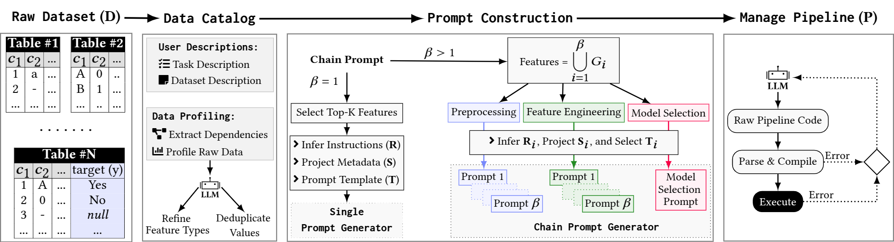

# CatDB: Data-catalog-guided, LLM-based Generation of Data-centric ML Pipelines



**Overview:** CatDB a comprehensive, LLM-guided generator of data-centric ML pipelines that utilizes available data catalog information. We incorporate data profiling information and user descriptions into a chain of LLM prompts for data cleaning/augmentation, feature engineering, and model selection. Additionally, we devise a robust framework for managing the LLM interactions and handling errors through pipeline modifications and a knowledge base of error scenarios.


Resource        | Links
----------------|------
**Quick Start** | [Install and Quick Start](#Installation)
**Benchmark:** | [Execute experiments with a range of datasets and compare the results to baselines](https://github.com/CoDS-GCS/CatDB/tree/main/Experiments)


## Installation
* Clone CatDB Repository:
    ```
    git clone https://github.com/CoDS-GCS/CatDB.git
    ```
* Install Requirenments:
    ```
    cd CatDB/src/python/main
    python -m venv venv
    source venv/bin/activate 
    python -m pip install -r requirements.txt
    ```
## Configuration
- **API Configuration:** CatDB utilizes commercial and free online API services:
    - [OpenAI GPT](https://platform.openai.com/) (Commerical)
    - [Google Gemini](https://aistudio.google.com/) (Commerical and free for limited requestes)
    - [Groq Llama3](https://console.groq.com) (Commerical and free for limited requestes)
    
    After registering and obtaining your API keys, you'll need to: 
    1. Create a `.yaml` configuration file: Use the provided template to store your API keys.
        ```
            ---

            - llm_platform: OpenAI
            key_1: 'put OpenAI key 1 here.'
            key_2: 'put OpenAI key 2 here.'
            ....
            key_10: 'put OpenAI key 10 here.'

            - llm_platform: Meta
            key_1: 'put Groq key 1 here.'

            - llm_platform: Google
            key_1 : 'put Gemini key 1 here.'
        ```
    2. Set the configuration file path: Specify the path to your config file in your operating system's environment variables.
        ```
        export APIKeys_File=path/to/.yaml/config/file
        ```

    
    You can add up to 10 keys for each platform to your configuration file.

- **Model Configuration:** CatDB supports a diverse list of models, including: *GPT (4.0, 4-turbo)*, *Gemini (1.5-pro-latest, 1.5-pro-exp-0801, 1.5-pro-exp-0827)*, and 
*Llama (llama-3.1-70b-versatile, llama3-70b-8192)*. This list is not exhaustive. If you need to add a new model or update existing model settings (e.g., `temperature`, `token_limit`, ...), simply modify the `Config.yaml` (`src/python/main/Config.yaml`) file.     
    
### Data Catalog and Prepare Data
* **Data Ctalog:** CatDB utilizes [kglids](https://github.com/CoDS-GCS/kglids) data profiling outputs. We need to run data profiling on each dataset individually and store the outputs. (A list of example data profiling outputs can be found in the Experiments subdirectory.)
* **Prepare Data:** CatDB requires specifying the dataset splits (`Train`, `Verify`, and `Test`) and the task type (`binary`, `multiclass`, or `regression`) along with the target attribute. All this metadata should be provided in a `.yaml` file. Here's a template for the metadata file:

    ```
    --- 
 
    - name: dataset_name
    dataset:
        multi_table: True/False
        train: 'dataset_name_train.csv' # Path to train dataset
        test: 'dataset_name_test.csv' # Path to test dataset
        verify: 'dataset_name_verify.csv' # Path to verify dataset
        target_table: target_table_name # If you have a single-table dataset, use the same name as the dataset name.
        target: 'target_col_name' # Target feature name
        type: multiclass # Task type
    ```
**Note:** The suffixes `_train.csv`, `_test.csv`, and `_verify.csv` are mandatory.

## Run CatDB
* Run CatDB to Generating ML Pipeline:
    ```
    python main.py \
        --llm-model \ 
        --metadata-path \
        --root-data-path \
        --catalog-path \
        --prompt-representation-type \
        --prompt-number-iteration \
        --prompt-number-iteration-error \
        --output-path \
        --result-output-path \
        --error-output-path
    ```

Description of Parameters:
- *--llm-model:* An LLM model name. For example, `--llm-model gpt-4o`
- *--metadata-path:* Path to the file created in the data preparation subsection. For example, `--metadata-path /tmp/datasets/dataset1.yaml`
- *--root-data-path:* Path to the root directory of the split datasets. For example, `--root-data-path /tmp/datasets`
- *--catalog-path:* Path to the data catalog files outputted by the data profiling section. For example, `--catalog-path /tmp/datasets/dataset1-catalog/`
- *--prompt-representation-type:* Specifies the prompt construction method: `CatDB` or `CatDBChain`
- *--prompt-number-iteration-error:* Sets the number of iterations the system can use the LLM to fix errors in the generated pipeline. For example, `--prompt-number-iteration-error 10`
- *--output-path:* Path to the system output. The output includes the constructed prompt and the generated pipeline. For example, `--output-path /tmp/catdb-results`
- *--result-output-path:* Path to the output of the generated pipeline. It includes metric results, execution time, LLM latency, and system cost (token count). For example, `/tmp/dataset1-results.csv`
- *--error-output-path:* Path to the error log. Errors are classified by type, materialized by dataset name, and include the full error message and pipeline information. For example, `--error-output-path /tmp/catdb-errors.csv`
